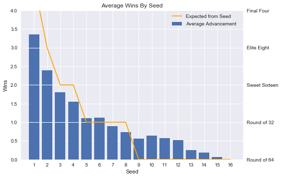
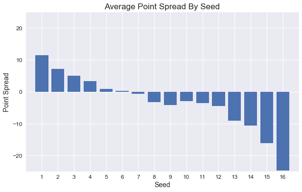
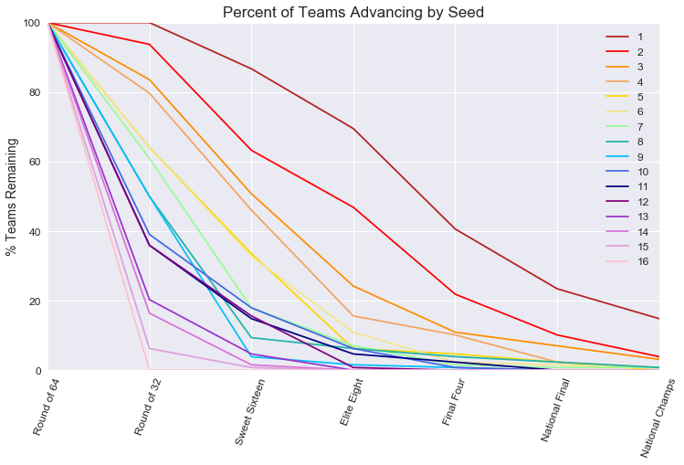
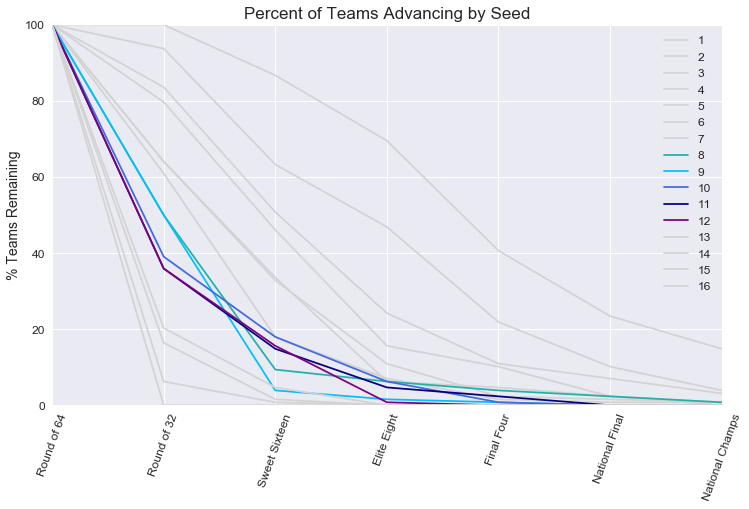
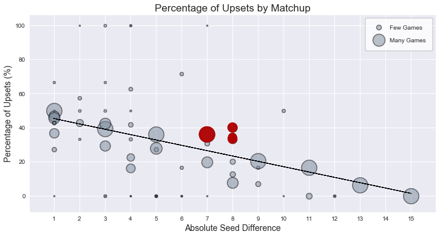
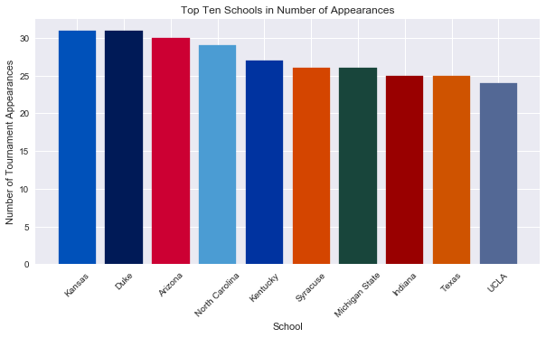
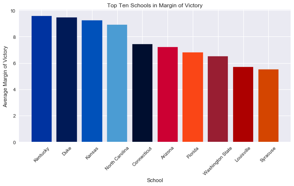
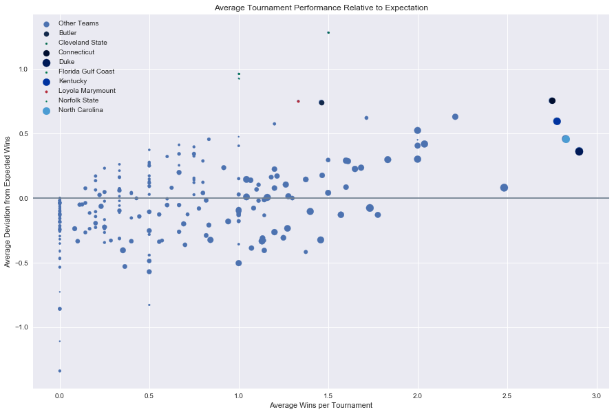
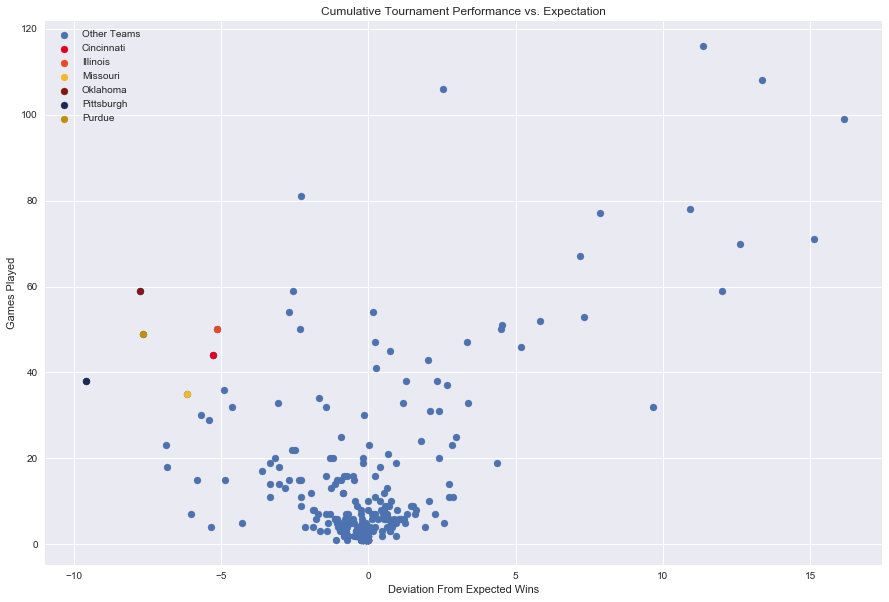

# March Madness Analysis

College basketball fans can better understand the NCAA Tournament by reviewing and analyzing data from previous years. In this report, results from every March Madness game between 1985 and 2016 are analyzed to identify the following trends:
- Expected performance according to seed
- Matchups that often result in exciting games
- Outliers who have exceeded their expectation

This information can be used to identify games that are likely to be interesting, predict winners, or understand a team's tournament history.

## Import Dependencies and Prep Data

<table border="1" class="dataframe">
  <thead>
    <tr style="text-align: right;">
      <th></th>
      <th>game_id</th>
      <th>date</th>
      <th>round</th>
      <th>region</th>
      <th>seed</th>
      <th>team</th>
      <th>score</th>
      <th>opponent_seed</th>
      <th>opponent</th>
      <th>opponent_score</th>
      <th>overtime</th>
      <th>score_diff</th>
      <th>win</th>
      <th>seed_id</th>
      <th>year</th>
    </tr>
  </thead>
  <tbody>
    <tr>
      <th>0</th>
      <td>0</td>
      <td>1985-03-14</td>
      <td>Round of 64</td>
      <td>East</td>
      <td>1</td>
      <td>Georgetown</td>
      <td>68</td>
      <td>16</td>
      <td>Lehigh</td>
      <td>43</td>
      <td>0</td>
      <td>25</td>
      <td>1</td>
      <td>1_16_fav</td>
      <td>1985</td>
    </tr>
    <tr>
      <th>1</th>
      <td>0</td>
      <td>1985-03-14</td>
      <td>Round of 64</td>
      <td>East</td>
      <td>16</td>
      <td>Lehigh</td>
      <td>43</td>
      <td>1</td>
      <td>Georgetown</td>
      <td>68</td>
      <td>0</td>
      <td>-25</td>
      <td>0</td>
      <td>1_16_dog</td>
      <td>1985</td>
    </tr>
    <tr>
      <th>2</th>
      <td>1</td>
      <td>1985-03-14</td>
      <td>Round of 64</td>
      <td>East</td>
      <td>4</td>
      <td>Loyola, Illinois</td>
      <td>59</td>
      <td>13</td>
      <td>Iona</td>
      <td>58</td>
      <td>0</td>
      <td>1</td>
      <td>1</td>
      <td>4_13_fav</td>
      <td>1985</td>
    </tr>
    <tr>
      <th>3</th>
      <td>1</td>
      <td>1985-03-14</td>
      <td>Round of 64</td>
      <td>East</td>
      <td>13</td>
      <td>Iona</td>
      <td>58</td>
      <td>4</td>
      <td>Loyola, Illinois</td>
      <td>59</td>
      <td>0</td>
      <td>-1</td>
      <td>0</td>
      <td>4_13_dog</td>
      <td>1985</td>
    </tr>
    <tr>
      <th>4</th>
      <td>2</td>
      <td>1985-03-14</td>
      <td>Round of 64</td>
      <td>East</td>
      <td>5</td>
      <td>Southern Methodist</td>
      <td>85</td>
      <td>12</td>
      <td>Old Dominion</td>
      <td>68</td>
      <td>0</td>
      <td>17</td>
      <td>1</td>
      <td>5_12_fav</td>
      <td>1985</td>
    </tr>
  </tbody>
</table>

# How does each seed typically perform?

Key Takeaways:
- As expected, high seeds generally outperform low seeds.
- There are exceptions, as 9 seeds win fewer games on average than 10 and 11 seeds, and 5 seeds win fewer games on average than 6 seeds.
- When performing a statistical analysis, many seeds' performances are not significantly different than the neighboring seeds. Interestingly, seeds 8-12 do not have a significant difference in average point margin per game.

## Gather Summary Data on Each Seed

<table border="1" class="dataframe">
  <thead>
    <tr style="text-align: right;">
      <th></th>
      <th>Average Point Spread</th>
      <th>Average Wins</th>
      <th>Wins by Round</th>
    </tr>
    <tr>
      <th>Seed</th>
      <th></th>
      <th></th>
      <th></th>
    </tr>
  </thead>
  <tbody>
    <tr>
      <th>1</th>
      <td>11.392193</td>
      <td>3.351562</td>
      <td>round
Elite Eight               52
National Ch...</td>
    </tr>
    <tr>
      <th>2</th>
      <td>7.109302</td>
      <td>2.398438</td>
      <td>round
Elite Eight               28
National Ch...</td>
    </tr>
    <tr>
      <th>3</th>
      <td>4.960452</td>
      <td>1.796875</td>
      <td>round
Elite Eight               14
National Ch...</td>
    </tr>
    <tr>
      <th>4</th>
      <td>3.313846</td>
      <td>1.546875</td>
      <td>round
Elite Eight               13
National Ch...</td>
    </tr>
    <tr>
      <th>5</th>
      <td>0.892593</td>
      <td>1.109375</td>
      <td>round
Elite Eight               6
National Cha...</td>
    </tr>
    <tr>
      <th>6</th>
      <td>0.335793</td>
      <td>1.125000</td>
      <td>round
Elite Eight               3
National Cha...</td>
    </tr>
    <tr>
      <th>7</th>
      <td>-0.585062</td>
      <td>0.890625</td>
      <td>round
Elite Eight               2
National Cha...</td>
    </tr>
    <tr>
      <th>8</th>
      <td>-3.281818</td>
      <td>0.726562</td>
      <td>round
Elite Eight               5
National Cha...</td>
    </tr>
    <tr>
      <th>9</th>
      <td>-4.220000</td>
      <td>0.562500</td>
      <td>round
Elite Eight             1
National Semif...</td>
    </tr>
    <tr>
      <th>10</th>
      <td>-3.028571</td>
      <td>0.640625</td>
      <td>round
Elite Eight             1
National Semif...</td>
    </tr>
    <tr>
      <th>11</th>
      <td>-3.524752</td>
      <td>0.578125</td>
      <td>round
Elite Eight             3
National Semif...</td>
    </tr>
    <tr>
      <th>12</th>
      <td>-4.461538</td>
      <td>0.523438</td>
      <td>round
Elite Eight       0
Round of 32      20
...</td>
    </tr>
    <tr>
      <th>13</th>
      <td>-9.043750</td>
      <td>0.250000</td>
      <td>round
Round of 32       6
Round of 64      26
...</td>
    </tr>
    <tr>
      <th>14</th>
      <td>-10.688742</td>
      <td>0.179688</td>
      <td>round
Round of 32       2
Round of 64      21
...</td>
    </tr>
    <tr>
      <th>15</th>
      <td>-16.065693</td>
      <td>0.070312</td>
      <td>round
Round of 32      1
Round of 64      8
Sw...</td>
    </tr>
    <tr>
      <th>16</th>
      <td>-24.718750</td>
      <td>0.000000</td>
      <td>round
Round of 64    0
Name: win, dtype: int64</td>
    </tr>
  </tbody>
</table>

## Compare Average Wins By Seed

As expected, higher seeds generally outperform lower seeds. There are exceptions, as 9 seeds win fewer games on average than 10 and 11 seeds, and 5 seeds win fewer games on average than 6 seeds. When plotted against the number of wins that would be expected if the higher seed won each game, the expected levels of advancement appear to generally hold true.

## Compare Average Point Margin by Seed

As expected, high seeds have a better average margin of victory than lower seeds. Only seeds 1-6 have positive average point margins, which can be explained by the single elimination format - teams that lose early on in the tournament do not have an opportunity to improve their point margin. 9 seeds also underperform in this area as they have a poorer point margin than both 10 and 11 seeds.

## Typical Tournament Advancement By Seed

The plot below shows the percentage of each seed that advances to each round of the NCAA Tournament. As expected, higher seeds generally outperform lower seeds. There is an interesting trend highlighted in the second plot: while 10-12 seeds are less likely to achieve an upset and advance to the 2nd round, when they do, they are much more likely to win their 2nd round matchup than 8 or 9 seeds. This results in 10, 11, and 12 seeds advancing to the Sweet Sixteen more often than 8 and 9 seeds. This trend can be explained by matchups, and the fact that 8 and 9 seeds that win their first round game must then play a 1 seed in the 2nd round, while 10-12 seeds face easier 2nd round matchups.

## Statistical Comparison of Seeds

Below are the results of a statistical comparison of each seed's average point margin. The average point margin for every team of each seed was collected and a paired t-test was performed on each set of seeds to determine if they were significantly different from one another. As expected, seeds far from each other are very different, but neighboring seeds often did not meet the 0.05 threshold to be considered significantly different from one another. This allowed us to group seeds' performance into the following statistically similar and unique sets:
[1, 2, (3, 4), (5, 6, 7), (8, 9, 10, 11, 12), (13, 14), 15, 16]

<table border="1" class="dataframe">
  <thead>
    <tr style="text-align: right;">
      <th></th>
      <th>P Value</th>
      <th>Seeds Compared</th>
      <th>Significant Difference</th>
    </tr>
  </thead>
  <tbody>
    <tr>
      <th>29</th>
      <td>0.093204</td>
      <td>3 and 4</td>
      <td>False</td>
    </tr>
    <tr>
      <th>54</th>
      <td>0.587780</td>
      <td>5 and 6</td>
      <td>False</td>
    </tr>
    <tr>
      <th>55</th>
      <td>0.159540</td>
      <td>5 and 7</td>
      <td>False</td>
    </tr>
    <tr>
      <th>65</th>
      <td>0.376600</td>
      <td>6 and 7</td>
      <td>False</td>
    </tr>
    <tr>
      <th>84</th>
      <td>0.427234</td>
      <td>8 and 9</td>
      <td>False</td>
    </tr>
    <tr>
      <th>85</th>
      <td>0.821109</td>
      <td>8 and 10</td>
      <td>False</td>
    </tr>
    <tr>
      <th>86</th>
      <td>0.834070</td>
      <td>8 and 11</td>
      <td>False</td>
    </tr>
    <tr>
      <th>87</th>
      <td>0.305909</td>
      <td>8 and 12</td>
      <td>False</td>
    </tr>
    <tr>
      <th>92</th>
      <td>0.313126</td>
      <td>9 and 10</td>
      <td>False</td>
    </tr>
    <tr>
      <th>93</th>
      <td>0.568254</td>
      <td>9 and 11</td>
      <td>False</td>
    </tr>
    <tr>
      <th>94</th>
      <td>0.841835</td>
      <td>9 and 12</td>
      <td>False</td>
    </tr>
    <tr>
      <th>99</th>
      <td>0.668556</td>
      <td>10 and 11</td>
      <td>False</td>
    </tr>
    <tr>
      <th>100</th>
      <td>0.213455</td>
      <td>10 and 12</td>
      <td>False</td>
    </tr>
    <tr>
      <th>105</th>
      <td>0.431084</td>
      <td>11 and 12</td>
      <td>False</td>
    </tr>
    <tr>
      <th>114</th>
      <td>0.178705</td>
      <td>13 and 14</td>
      <td>False</td>
    </tr>
  </tbody>
</table>

    [1, 2, (3, 4), (5, 6, 7), (8, 9, 10, 11, 12), (13, 14), 15, 16]

# Which matchups are most likely to produce upsets?
Key Takeaways:
- There is a linear relationship between absolute seed difference and percentage of upsets in matchups.
- Every game between a 2 and 5 seed has resulted in an upset.
- 40% of games between a 2 and 10 seed has resulted in an upset.

The purpose of this section is to determine which matchups are most likely to produce upsets relative to the absolute seed difference of the teams. Matchups of evenly seeded teams were not considered.

Two dataframes were created to analyze and plot the data.  The first dataframe has one record for each game from the perspective of the underdogs.  This dataframe was used to create a line of best fit to generate the expected upset percentage by absolute seed difference. The second dataframe has one record for each game from the perspective of the winners.  It was used to compare each matchup's historical upset percentage to expected upset percentage and plot the data.

The analysis below highlights two subsets of matchups, but the underlying code contains functions that can be used to look at any subset.

## Relatively high likelihood of upsets for matchups that don't occur often

This subset was defined as matchups that occur less than every four years on average. To eliminate extreme outliers, the matchups also must have occurred at least three times since 1985.  From this subset, the four matchups with the most drastic deviation from expected upset percentage are:

### 2 seed vs 5 seed
- 4 total games
- 100% have been upsets

### 2 seed vs 8 seed
- 7 total games
- 71% have been upsets

### 1 seed vs 11 seed
- 6 total matchups
- 50% have been upsets

### 2 seed vs 4 seed
- 7 total matchups
- 57% have been upsets

## Relatively high likelihood of upsets for matchups that occur every year

This subset was defined as matchups that occur at least once every year on average. The four matchups with the most drastic deviation from expected upset percentage are:

### 2 seed vs 10 seed
- 45 total games
- 40% have been upsets

### 4 seed vs 12 seed
- 35 total games
- 34% have been upsets

### 3 seed vs 11 seed
- 42 total matchups
- 33% have been upsets

### 5 seed vs 12 seed
- 128 total matchups
- 36% have been upsets

# How have individual teams performed in the tournament historically?

Key Takeaways:

- Even the teams that have performed the best historically average less than three wins per tournament.

- Most of the teams that have performed the best historically are schools that most fans would associate with being the best in men's college basketball.

- The average number of wins for a given seed was used to predict the number of "expected wins" for each team based on their seeding for each year.

- Expected wins was used to find teams that have historically over/underperformed.

## Quantifying Team Performance

First, we grouped the results of each game by the teams playing to find the following quantities for each team that has been in the tournament: tournament appearances, games played, games won, win percentage, total point margin, average point margin, average wins per tournament, wins expected based on the historical performance of teams with the same seed, expected games played, deviation from expected wins, and average deviation from expected wins. This information was stored in a dataframe so that the results for individual teams could be accessed and compared.

<table border="1" class="dataframe">
  <thead>
    <tr style="text-align: right;">
      <th></th>
      <th>Team</th>
      <th>Tournament Appearances</th>
      <th>Games Played</th>
      <th>Games Won</th>
      <th>Win Percentage</th>
      <th>Total Point Margin</th>
      <th>Average Point Margin</th>
      <th>Average Number of Wins</th>
      <th>Expected Wins</th>
      <th>Expected Games Played</th>
      <th>Deviation From Expected Wins</th>
      <th>Average Deviation From Expected Wins</th>
    </tr>
  </thead>
  <tbody>
    <tr>
      <th>0</th>
      <td>Air Force</td>
      <td>2</td>
      <td>2</td>
      <td>0</td>
      <td>0</td>
      <td>-20</td>
      <td>-10</td>
      <td>0</td>
      <td>0.828125</td>
      <td>2.82812</td>
      <td>-0.828125</td>
      <td>-0.414062</td>
    </tr>
    <tr>
      <th>1</th>
      <td>Akron</td>
      <td>4</td>
      <td>4</td>
      <td>0</td>
      <td>0</td>
      <td>-78</td>
      <td>-19.5</td>
      <td>0</td>
      <td>0.914062</td>
      <td>4.91406</td>
      <td>-0.914062</td>
      <td>-0.228516</td>
    </tr>
    <tr>
      <th>2</th>
      <td>Alabama</td>
      <td>15</td>
      <td>33</td>
      <td>18</td>
      <td>0.545455</td>
      <td>34</td>
      <td>1.0303</td>
      <td>1.2</td>
      <td>16.8203</td>
      <td>31.8203</td>
      <td>1.17969</td>
      <td>0.0786458</td>
    </tr>
    <tr>
      <th>3</th>
      <td>Alabama State</td>
      <td>2</td>
      <td>2</td>
      <td>0</td>
      <td>0</td>
      <td>-69</td>
      <td>-34.5</td>
      <td>0</td>
      <td>0</td>
      <td>2</td>
      <td>0</td>
      <td>0</td>
    </tr>
    <tr>
      <th>4</th>
      <td>Albany</td>
      <td>5</td>
      <td>5</td>
      <td>0</td>
      <td>0</td>
      <td>-73</td>
      <td>-14.6</td>
      <td>0</td>
      <td>0.5</td>
      <td>5.5</td>
      <td>-0.5</td>
      <td>-0.1</td>
    </tr>
  </tbody>
</table>

## Finding the "Top Teams"

We then sorted by the number of tournament appearances to find the schools that had been in the most tournaments since the format was changed to include 64 teams. The results were similar to what we originally expected them to be and consisted of schools that have a reputation for being good at men's basketball.

Next we sorted by the number of games won by schools in the NCAA tournament. This consisted of many of the same teams that were in the top ten for most tournament appearances. It was interesting to see what a large spread there was between the number of wins for Duke which was first in this category and UCLA which was tenth. It also showed that some schools like Connecticut get a lot of wins each time they are in the tournament but don't necessarily make it into as many tournaments as some of the other schools included.

Finally, we sorted the teams by the net average point spread. Again this mostly consisted of the same teams with just a few exceptions. The fact that Kentucky, Duke and Kansas average almost a positive 10 point victory in every game they play in the tournament was higher than expected.

## Finding Over and Underperforming Teams

We plotted the average deviation from the expected number of wins per tournament versus the average  number of wins per tournament to showcase the teams that had overperformed their seeding and had consistently went far in the tournament. The size of the points were based on the number of total games a team has played in the tournament. The large red points on the very right side of the graph represented schools that consistently win a lot of games in the tournament and outperform their seeds. The smaller points in red didn't make as far into the tournament on average, but still overperformed their expected results.

This table shows the average number of wins, average deviation from expected wins, games played, and tournament appearances for the teams highlighted in the previous graph. The fact that Duke, North Carolina, Kentucky, and Connecticut had such a high number of wins and often overperformed their seeds was not surprising consider their position on the total number of wins bar graph shown earlier. It was also expected that they wouldn't overperform their seed as often since they are often seeded very high.

It was interesting that there was a team like Butler that almost wins an extra game more than expected every tournament and had a large number of appearances and games played. Their run to the final four a few years ago probably skews this slightly though.

<table border="1" class="dataframe">
  <thead>
    <tr style="text-align: right;">
      <th></th>
      <th>Team</th>
      <th>Average Number of Wins</th>
      <th>Average Deviation From Expected Wins</th>
      <th>Games Played</th>
      <th>Tournament Appearances</th>
    </tr>
  </thead>
  <tbody>
    <tr>
      <th>64</th>
      <td>Duke</td>
      <td>2.90323</td>
      <td>0.366179</td>
      <td>116</td>
      <td>31</td>
    </tr>
    <tr>
      <th>169</th>
      <td>North Carolina</td>
      <td>2.82759</td>
      <td>0.460399</td>
      <td>108</td>
      <td>29</td>
    </tr>
    <tr>
      <th>115</th>
      <td>Kentucky</td>
      <td>2.77778</td>
      <td>0.597801</td>
      <td>99</td>
      <td>27</td>
    </tr>
    <tr>
      <th>52</th>
      <td>Connecticut</td>
      <td>2.75</td>
      <td>0.756641</td>
      <td>71</td>
      <td>20</td>
    </tr>
    <tr>
      <th>47</th>
      <td>Cleveland State</td>
      <td>1.5</td>
      <td>1.28516</td>
      <td>5</td>
      <td>2</td>
    </tr>
    <tr>
      <th>28</th>
      <td>Butler</td>
      <td>1.46154</td>
      <td>0.74399</td>
      <td>32</td>
      <td>13</td>
    </tr>
    <tr>
      <th>128</th>
      <td>Loyola Marymount</td>
      <td>1.33333</td>
      <td>0.752604</td>
      <td>7</td>
      <td>3</td>
    </tr>
    <tr>
      <th>77</th>
      <td>Florida Gulf Coast</td>
      <td>1</td>
      <td>0.964844</td>
      <td>4</td>
      <td>2</td>
    </tr>
    <tr>
      <th>168</th>
      <td>Norfolk State</td>
      <td>1</td>
      <td>0.929688</td>
      <td>2</td>
      <td>1</td>
    </tr>
  </tbody>
</table>

We plotted the total number of tournament games played versus the total deviation from expected wins. The teams in red are examples that have lots of tournament appearances but don't necessarily perform at the level expected based on their seeding. This trend was harder to show with the previous plot.

This table shows the average number of wins, average deviation from expected wins, games played, and tournament appearances for the teams highlighted in the previous graph. These teams were more similar in the average number of wins per tournament than was originally expected.

<table border="1" class="dataframe">
  <thead>
    <tr style="text-align: right;">
      <th></th>
      <th>Team</th>
      <th>Average Number of Wins</th>
      <th>Average Deviation From Expected Wins</th>
      <th>Games Played</th>
      <th>Tournament Appearances</th>
    </tr>
  </thead>
  <tbody>
    <tr>
      <th>188</th>
      <td>Oklahoma</td>
      <td>1.45833</td>
      <td>-0.323568</td>
      <td>59</td>
      <td>24</td>
    </tr>
    <tr>
      <th>101</th>
      <td>Illinois</td>
      <td>1.27273</td>
      <td>-0.23402</td>
      <td>50</td>
      <td>22</td>
    </tr>
    <tr>
      <th>45</th>
      <td>Cincinnati</td>
      <td>1.2</td>
      <td>-0.263281</td>
      <td>44</td>
      <td>20</td>
    </tr>
    <tr>
      <th>204</th>
      <td>Purdue</td>
      <td>1.13043</td>
      <td>-0.33288</td>
      <td>49</td>
      <td>23</td>
    </tr>
    <tr>
      <th>198</th>
      <td>Pittsburgh</td>
      <td>1</td>
      <td>-0.503701</td>
      <td>38</td>
      <td>19</td>
    </tr>
    <tr>
      <th>150</th>
      <td>Missouri</td>
      <td>0.842105</td>
      <td>-0.323602</td>
      <td>35</td>
      <td>19</td>
    </tr>
  </tbody>
</table>

